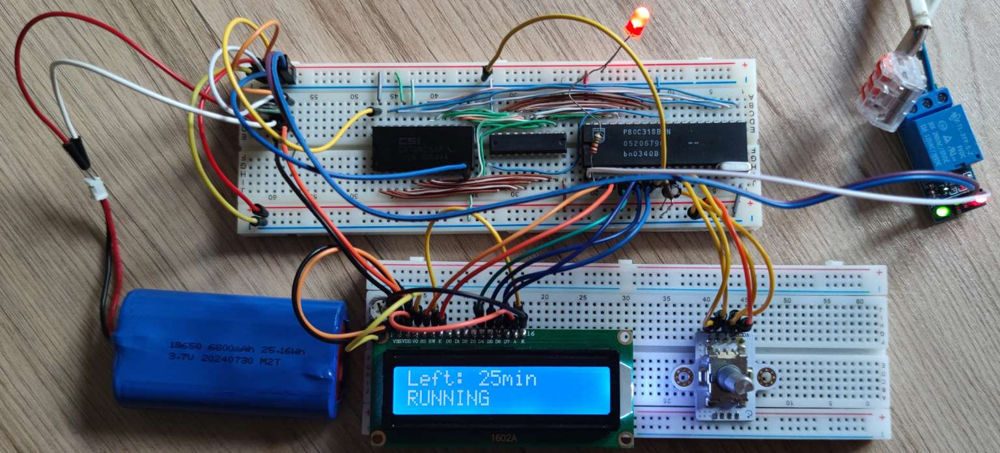

# 80C31-Timer

 

A simple timer based on the Philips P80C31SBCN microcontroller, designed to turn on an output for a specified duration. The parameters are configured using a rotary encoder with a button and a 16x2 HD44780-compatible display. When paired with a relay, it can power a device for 1 to 99 minutes, with a delay of 1 to 99 seconds before activation.

I built it because I needed a timer to control a UV-C lamp I use for erasing EPROMs. Staying true to my DIY spirit, I didn’t buy a commercial EPROM eraser. Instead, I got a 9W UV-C bulb from a UV sterilizer for 10 PLN (about $2.50) and plugged it into my desk lamp, which conveniently has the same G23 socket and a similar power rating (11W).

This setup has an obvious drawback: it's hard to make it lightproof. And since UV-C radiation is extremely harmful - especially to the eyes - I wanted to avoid exposure. That’s where the delay feature comes in: it gives me time to safely leave the room before the lamp turns on.

Why use an MCS-51 MCU in 2025? Well, I like old tech and have plenty of those chips :wink: Plus, I wanted to see if it was possible to create a CMake-based project for SDCC.
